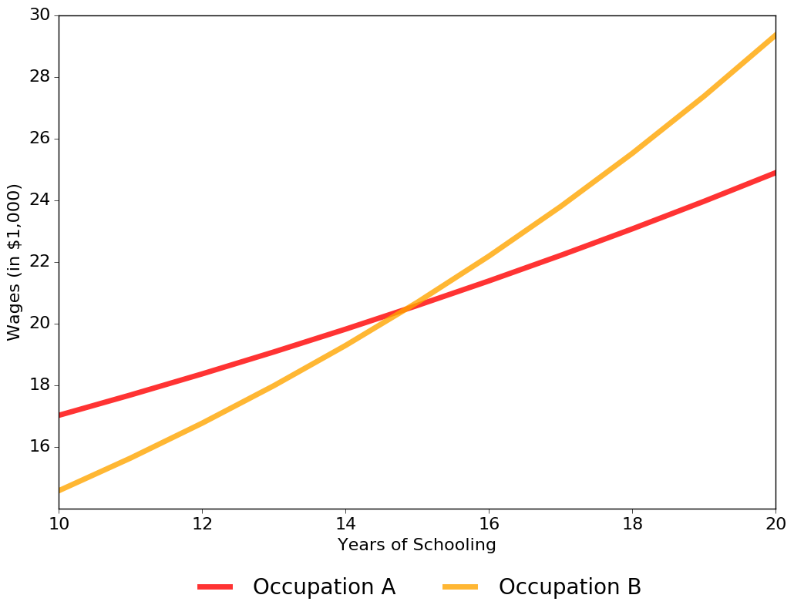
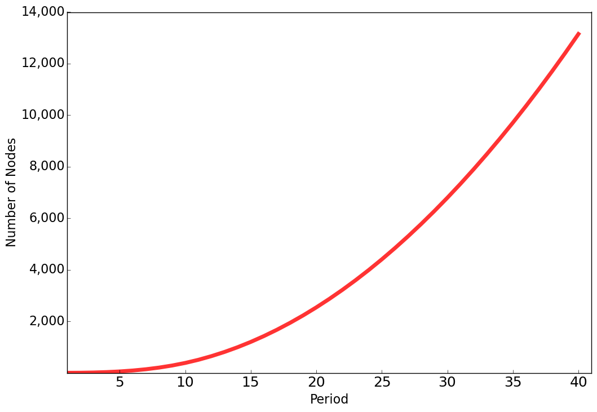

.. _specification:

Economic Model
===================

Keane and Wolpin (1994) develop a model in which an agent decides among :math:`K` possible alternatives in each of :math:`T` (finite) discrete periods of time.  Alternatives are defined to be mutually exclusive and :math:`d_k(t) = 1` indicates that alternative :math:`k` is chosen at time :math:`t` and :math:`d_k(t)  = 0` indicates otherwise. Associated with each choice is an immediate reward :math:`R_k(S(t))` that is known to the agent at time :math:`t` but partly unknown from the perspective of periods prior to :math:`t`. All the information known to the agent at time :math:`t` that affects immediate and future rewards is contained in the state space :math:`S(t)`.

We depict the timing of events in the figure below. At the beginning of period :math:`t` the agent fully learns about the all immediate rewards, choose one of the alternatives and receives the corresponding benefits. The state space is then updated according to the agent's state experience and the process is repeated in :math:`t + 1`.

.. image:: images/timing.png

Agents are forward looking. Thus, the do not simply choose the alternative with the highest immediate rewards. Instead their objective at any time :math:`\tau = 0, ...,T` is to maximize the expected rewards over their whole remaining time horizon:

.. math::
    \max_{\{d_k(t)\}_{k \in K}} E\left[ \sum_{\tau = t}^T \delta^{\tau - t} \sum_{k\in K}R_k(\tau)d_k(\tau)\Bigg| S(t)\right]

The discount factor :math:`0 > \delta > 1` captures the agent's preference for immediate over future rewards. Agents maximize the equation above by choosing the optimal sequence of alternatives
:math:`\{d_k(t)\}_{k \in K}` or :math:`t = \tau, .., T`.

Within this more general framework, Keane and Wolpin (1994) consider the case where agents risk neutral and each period choose to work in either of two occupations (:math:`k =  1,2`), to attend school (:math:`k = 3`), or to remain at home (:math:`k = 4`). The immediate reward functions are given by:

.. math::

    \begin{align*}
    R_1(t) &= w_{1t} =\exp\{\alpha_{10} + \alpha_{11}s_t + \alpha_{12}x_{1t} - \alpha_{13}x^2_{1t} + \alpha_{14}x_{2t} - \alpha_{15}x^2_{2t} + \epsilon_{1t}\}\\
    R_2(t) &= w_{2t} =\exp\{\alpha_{20} + \alpha_{21}s_t + \alpha_{22}x_{1t} - \alpha_{23}x^2_{1t} + \alpha_{24}x_{2t} - \alpha_{25}x^2_{2t} + \epsilon_{2t}\}\\
    R_3(t) &= \beta_0 - \beta_1 I(s_t \geq 12) - \beta_2(1 - d_3(t -1)) + \epsilon_{3t} \\
    R_4(t) &= \gamma_0 + \epsilon_{4t},
    \end{align*}

where :math:`s_t` is the number of periods of schooling obtained by the beginning of period :math:`t`, :math:`x_{1t}` is the number of periods that the agent worked in occupation one (experience) by the beginning of period :math:`t`, :math:`x_{2t}` is the analogously defined level of experience in occupation two, :math:`\alpha_1` and :math:`\alpha_2` are parameter vectors associated with the wage functions, :math:`\beta_0` is the consumption value of schooling, :math:`\beta_1` is the post-secondary tuition cost of schooling, with :math:`I` an indicator function equal to one if :math:`s\geq 12` (the agent has completed high school) and zero otherwise, :math:`\beta_2` is an adjustment cost associated with returning to school (if :math:`d_3(t - 1) = 0`), :math:`\gamma_0` is the (mean) value of the non-market alternative. The :math:`\epsilon_{kt}`'s are alternative-specific shocks, to occupational productivity, to the consumption value of schooling, and to the value of non-market time. The productivity and taste shocks follow a four-dimensional multivariate normal distribution with mean zero and covariance matrix :math:`\Sigma`. The realizations are independent across time.

Given the structure of the immediate rewards, the state space at time :math:`t` is

.. math::

    \begin{align*}
    S(t) = \{s_t,x_{1t},x_{2t}, d_3(t - 1),\epsilon_{1t},\epsilon_{2t},\epsilon_{3t},\epsilon_{4t}\}.
    \end{align*}

It is convenient to denote the predetermined elements of the state space, :math:`s_t,x_{1t},x_{2t}, d_3(t - 1)`, as :math:`\bar{S}(t)`. The elements of :math:`S(t)` evolve according to:

.. math::
    \begin{align*}
    x_{1,t+1}  &= x_{1t} + d_1(t) \\
    x_{2,t+1} &= x_{2t} + d_2(t) \\
    s_{t+1}   &= s_{t\phantom{2}}    + d_3(t) \\
    f(\epsilon_{t+1}\mid S(t), d_k(t)) &= f(\epsilon_{t+1}\mid \bar{S}(t), d_k(t)),
    \end{align*}

where the last equation reflects the fact that the :math:`\epsilon_{kt}`'s are serially independent. I set the initial conditions as :math:`x_{1t} = x_{2t} = 0`.

Solution Approach
-----------------

From a mathematical perspective, this type of model boils down to a finite-horizon DP problem under uncertainty that can be solved by backward induction. For the discussion, it is useful to do define the value function :math:`V(S(t),t)` as a shorthand for the agents objective function. :math:`V(S(t),t)` depends on the state space at :math:`t` and on :math:`t` itself (due to the finiteness of the time horizon or the direct effect of age on rewards) and can be written as

.. math::

    \begin{align*}
    V(S(t),t) = \max_{k \in K}\{V_k(S(t),t)\},
    \end{align*}

with :math:`V_k(S(t),t)` as the alternative-specific value function. :math:`V_k(S(t),t)` obeys the Bellman equation (Bellman, 1957) and is thus amenable to a backward recursion.

.. math::

    \begin{align}\label{Bellman}
    V_k(S(t),t) = \begin{cases} R_k(S(t)) + \delta E\left[V(S(t + 1), t + 1) \mid S(t), d_k(t) = 1\right] &\qquad\mbox{if } t < T \\
    R_k(S(t)) &\qquad\mbox{if } t = T.
    \end{cases}
    \end{align}

Assuming continued optimal behavior, we must calculate expected future value of state :math:`S(t + 1)` for all :math:`K` alternatives given today's state :math:`S(t)` and choice :math:`d_k(t) = 1`. We must determine :math:`E\max(S(t + 1))` for short.

.. math::
    \begin{align}\label{emax}
    E\max(S(t + 1)) = E\left[V(S(t + 1), t + 1) \mid S(t), d_k(t) = 1\right].
    \end{align}

Future rewards are partly uncertain due to the existence of state variables at time :math:`t + 1` that are unknown beforehand. The expected future value for state :math:`S(t)` is calculated as:

.. math::
    \begin{align}
     E\max(S(t)) =\hspace{11cm}\\
    \int_{\epsilon_1(t)} ... \int_{\epsilon_K(t)}\max\{R_1(t), ..., R_K(t)\}f_{\epsilon}(\epsilon_1(t), ... ,\epsilon_K(t))d\epsilon_1(t) ... d\epsilon_K(t),
    \end{align}

where :math:`f_{\epsilon}` is the joint density of the uncertain component of the rewards in :math:`t` not known at :math:`t - 1`.

Simulated Sample
----------------
The returns to exeperience

.. image:: images/returns_experience.png

The returns to education.

Note that all agents start out identically, different choices over the life cycle are the cumulative effects of different shocks. Here is a look at the distribution of choices across the

.. image:: images/choice_patterns.png

Computational Challenges
------------------------

The evaluation of :math:`E\max` at each possible state creates a considerable computational burden. For example, even in this simplified model, it requires the repeated evaluation of the integral for the :math:`E\max` at a total of 163,410 states. During an estimation, the model has to be solved repeatedly for numerous alternative parameterizations.

This figure imposes the restriction that agents can only obtain 10 additional years of schooling.
