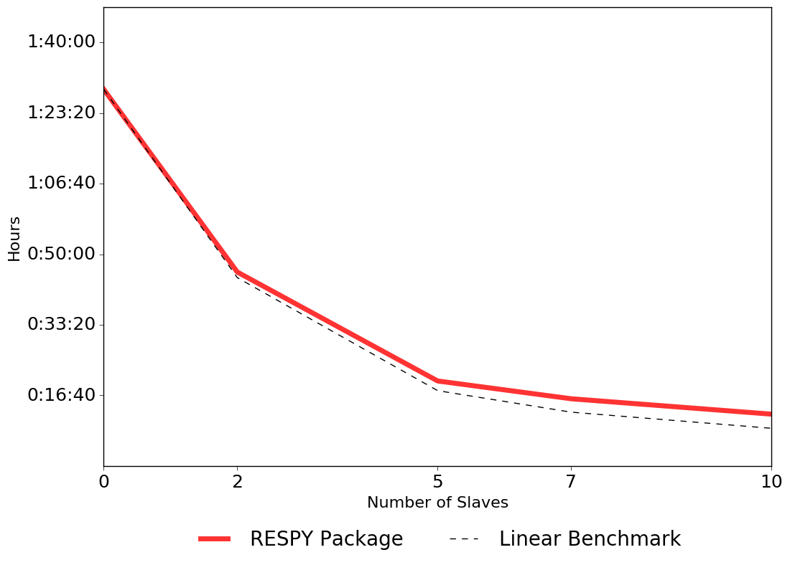

Scalability
===========

The solution and estimation a the dynamic programming model by a backward induction procedure appears straightforward. However, the algorithm imposes a considerable computational burden.

Consider the evaluation of the four-dimensional integral for the :math:`E\max` as an example. Thousands of different candidate parameterizations of the model are assessed with respect to the sample likelihood during an estimation. Each time, even in the simplified models considered in Keane (1994), we need to evaluate the :math:`E\max` at a total of 163,410 decision nodes. The figure below illustrates the well known curse of dimensionality (Bellman, 1957) as the number of decision nodes increases exponentially with each period.

.. image:: images/state_space.png
    :width: 500px
    :align: center
    :height: 500px

In addition, we also need evaluate the four-dimensional integral of the choice probabilities for each agent in each period to construct the sample likelihood.

To address the performance constraints of our Python implementation, we also maintain a scalar and parallel Fortran implementation. We distribute the total computational work across the multiple processors using the master-slave paradigm. More precisely, we assign each slave a subset of the decision nodes to evaluate the :math:`E\max` and a divide the agents to evaluate their choice probabilities.

The figure below shows the total computation time required for 1,000 evaluations of the criterion function as the number of slave processors increases. Judging against the linear benchmark, the code scales well over the range of processors.

Adding even more processors does not lead to any further improvements, it even increases the computational time. The main trade-off arises in the required synchronization of the :math:`E\max` results each period. Even though each processor is only working on a subset of decision nodes each period, they need access to the all the results from the later period during the backward induction procedure. The exact trade-off is affected by the computational burden imposed by each :math:`E\max` evaluation, e.g. the number of Monte Carlo draws. 

For more details, see the script `online <https://github.com/restudToolbox/package/blob/master/development/testing/scalability/run.py>`_. The results for all the parameterizations analyzed in Keane (1994) are available `here <https://github.com/restudToolbox/package/blob/master/doc/results/scalability.respy.info>`_.
