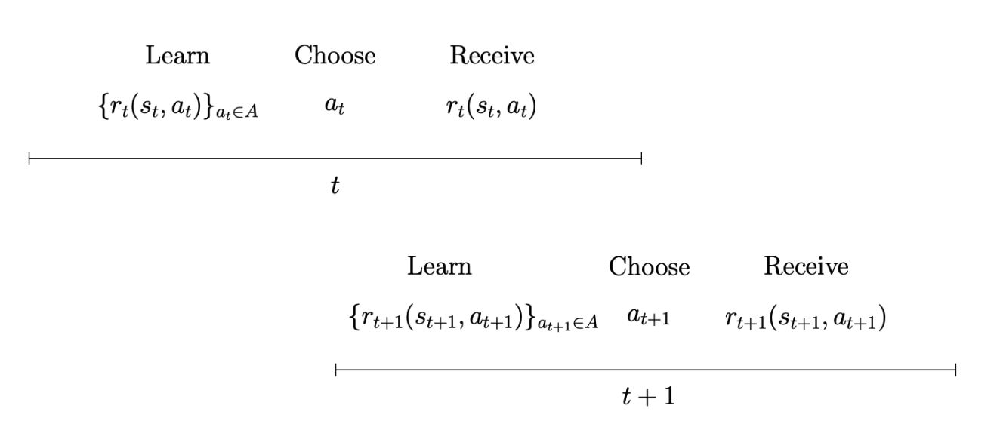
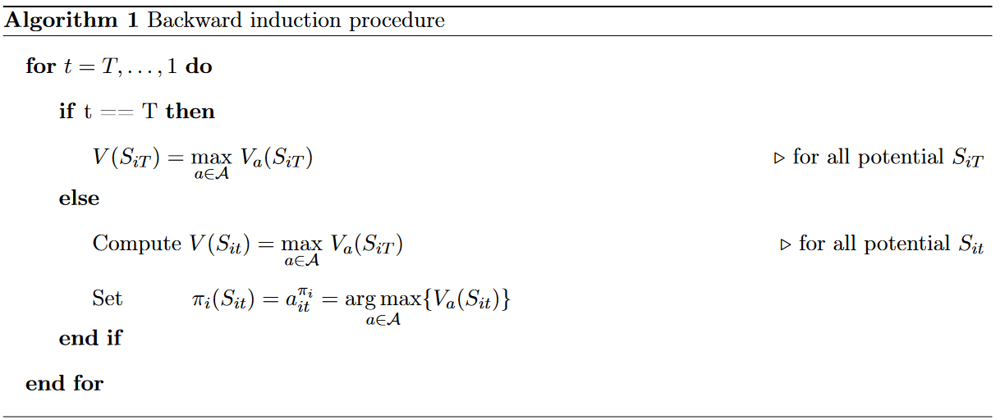

.. _solution_model:

Solution of the Model
=====================

.. role:: boldblue

Before we outline the solution of the model, we formally summarize the ideas developed in Section :ref:`economic_model`.
Mathematically, the class of EKW models (as the work from Keane and Wolpin (1997, :cite:`Keane.1997`) belongs to) is set up as a standard :boldblue:`Markov Decision Process` (Puterman, 1994, :cite:`Puterman.1994`; White, 1993, :cite:`White.1993`). Individuals make sequential decisions under uncertainty and aim to implement an optimal sequence of choices (policy) given the states of the world. In Section :ref:`State Space` we will formally introduce the state space and 

.. _State Space:

State Space
-----------

We will refer to the collection of state variables as :boldblue:`state space`. [#]_ The state space at time :math:`t` is given by

.. math::
   :label: eq:StateSpace

	S_{it} = [S_{i,16},  t_{it}, h_{it}, k_{it}, a_{i, t-1}, \epsilon_{it}],

where :math:`S_{i,16} = (e_{ik}, h_{i,16}, k_{i,16})` denotes the :boldblue:`initial conditions` with which the individual enters the model. Note that :math:`h_{i,16}` is given and :math:`k_{i,16}(a) = 0` for all :math:`a \in \mathcal{A}`. 

.. rst-class:: centerblue

        An explanation how to set and change initial conditions in ``respy`` is provided in `Initial Conditions <https://respy.readthedocs.io/en/latest/how_to_guides/initial_conditions.html>`_.

The other elements include
	- Current period :math:`t_{it}`
	- Years of completed schooling :math:`h_{it}`
	- Endowment vector of a type-:math:`k` individual :math:`e_{ik} = (e_{ik}(1), e_{ik}(2), e_{ik}(3), e_{ik}(4), e_{ik}(5))`
	- Work experience vector :math:`k_{it} = (k_{it}(1), k_{it}(2), k_{it}(3))`
	- Decision from the previous period :math:`a_{i,t-1} \in \mathcal{A}`
	- Technology shock vector :math:`\epsilon_{it} = (\epsilon_{it}(1), \epsilon_{it}(2), \epsilon_{it}(3), \epsilon_{it}(4), \epsilon_{it}(5))`

Notably, due to the assumption of :boldblue:`serially independent shocks` the state space does not contain past realizations of the shocks although contained in the information set of the individual. The persistence of the initial conditions as determinants of the current state variables induces serial dependence, hence persistent heterogeneity.

The state space can be divided into a subset that is observable by the researcher and into a subset the is unobservable to the researcher, but observable to the individuals. [#]_ The current :boldblue:`stock of human capital is observable`} by both and given by

.. math::
	
	s_{it} = [h_{it}, k_{it}, a_{i, t-1}].

Those :boldblue:`observable state variables` evolve deterministically according to:

	- :math:`h_{i, t+1} = h_{it} + \mathbb{1}(a_{it} = 4)` with :math:`h_{it} \leq \bar{h}`
	- :math:`k_{i,t+1}(1) = k_{i,t}(1) + \mathbb{1}(a_{it} = 1)`
	- :math:`k_{i,t+1}(2) = k_{i,t}(2) + \mathbb{1}(a_{it} = 2)`
	- :math:`k_{i,t+1}(3) = k_{i,t}(3) + \mathbb{1}(a_{it} = 3)`,

where :math:`\bar{h}` denotes the highest attainable level of schooling.

The :boldblue:`unobservable state variables` (only observable to the individual decision-maker) :math:`\epsilon_{it}` evolves stochastically according to a joint normal distribution with probability density function :math:`\phi_{\mu= 0, \Sigma}`. It is assumed that :math:`\epsilon_{it}  \sim \mathcal{N}_5(0, \Sigma)` is serially uncorrelated.

Summarized, the transition from sate :math:`S_{it}` to state :math:`S_{i,t+1}` is affected by the actions of the individual but still remains uncertain. The  :boldblue:`Markov transition probability distribution` for the evolution of state :math:`S_{it}` to :math:`S_{i,t+1}` is induced by the model and denoted with :math:`p_t(S_{it}, a_{it})`. [#]_ 

.. _dynamic_programming_problem:

Solving the Dynamic Programming Problem
---------------------------------------

The :boldblue:`dynamic structure` of the problem is introduced through decisions to work in a certain occupation, which leads to the accumulation of experience attributed the next period. Figure :ref:`timing_events` illustrates the timing of events described in Section :ref:`economic_model`}. 

.. _timing_events:

   Timing of events in the economic model

At each time :math:`t = 16, \dots, T` the individual decision-maker observes the state of the economic environment :math:`S_{it}` and learns about its elements (see Section :ref:`State Space`). By assumption, the decision-maker is aware of all occupation-specific rental prices, the skill technology functions, the schooling costs and the distribution of shocks. The per-period rewards (utility) can be directly inferred. 

Given the optimal policy :math:`\pi_i` she chooses the prescribed :math:`a_{it}^{\pi_i}`, receives the reward :math:`R_{a_{it}^{\pi_i}}(S_{it})`, and proceeds to the next period. At :math:`t+1` the individual decision-maker learns about the ''updated'' state space :math:`S_{i,t+1}` and the process repeats. :boldblue:`Note`, when making a decision to proceed from state :math:`S_{i,t}` to :math:`S_{i,t+1}` she does know the stochastic component of the Markov transition probability distribution :math:`p_{it}(S_{it}, a_{it})`, but does not know the future earnings.

In case of a :boldblue:`static decision-problem` the agent would consider each period in isolation and choose the alternative associated with the higher per-period payoff. He would not take into account the consequences of his actions. 

However, this does not hold true in a :boldblue:`dynamic programming (DP) problem`. Individuals are forward looking and aim to maximize the expected rewards over the remaining time horizon. In every period :math:`t` the decision-maker chooses :math:`a_{i\tau} \in \mathcal{A}` to maximize her expected utility conditional on the information carried in :math:`S_{it}`. The :boldblue:`value function` of the DP problem is given by 

.. math:: 
   :label: ValueFunction

	V(S_{it}) = \max_{a_{it} \in \mathcal{A}}~ \mathbb{E} \left[ \sum_{\tau = t}^T \delta^{\tau - t} \sum_{b=1}^{|\mathcal{A}|} R_b(S_{i\tau}) \cdot \mathbb{1}(a_{i\tau} =b) ~\big|~S_{it}  \right],

where :math:`\delta \in (0,1)` denotes the individual discount factor. The expectation is taken with respect to the distribution of the stochastic components conditional on :math:`S_{it}`.

The individual decision-maker maximizes Equation :eq:`ValueFunction` by choosing the policy :math:`\pi_i`, i.e. the optimal sequence of control variables :math:`\{ a_{it} \in \mathcal{A} \}_{t = 16}^T`.  

Solution via Recursion
^^^^^^^^^^^^^^^^^^^^^^
To make the problem more tractable Equation :eq:`ValueFunction` can be rewritten as the maximum over the :boldblue:`alternative-specific value functions`:

.. math::
   :label: AlternativeSpecificValueFunction

	V(S_{it}) = \max_{a \in \mathcal{A}}~V_a(S_{it}).

The alternative-specific value functions themselves depend on the evaluation period:

.. math::
   :label: AlternativeSpecificValueFunctions

    V_a(S_{it}) & = R_a(S_{it}) + \delta \cdot \mathbb{E} \left[ V_a(S_{i,t+1}) | S_{it}, I(a_{it} = a) \right] \\
	 & = R_a(S_{it}) + \delta \cdot \int_S V_a(S_{i,t+1})~\mathrm{d}p_t(S_{it}, a_{it}), ~~\text{ whenever } t< T \\
    V_a(S_{iT}) & = R_a(S_{iT}).

The expectation in Equation :eq:`AlternativeSpecificValueFunctions` is taken with respect to distribution of the stochastic components in :math:`S_{i,t+1}` *conditional* on :math:`S_{i,t}`. It is noteworthy that the alternative-specific value functions depends on all state variables, whereas the alternative-specific reward functions only depend on a subset. [#]_ 

.. rst-class:: centerblue

		The expected utility that comes along with each alternative is retrievable for each simulated model. In ``respy`` it is simply the value behind ``Value_Function_{Alternative}`` in period 0.}

At any given state :math:`S_{it}`, the :boldblue:`state-specific policy function`  :math:`\pi(S_{it})` provides the individual decision-maker with instructions to choose the optimal choices (control variables). The state-specific policy function is given by

.. math::
   :label: StateSpecificPolicyFunction

   \pi_i(S_{it}) = \arg \max_{ a \in \mathcal{A}} \{ V_a(S_{it}) \}.

The :boldblue:`policy` :math:`\pi \equiv \left(\pi(S_{i,16}), \dots, \pi(S_{iT}) \right)` collects the decision rules for any period-specific state vector :math:`S_{it}`. Notice that from the viewpoint of the individual the optimal decision rule is a deterministic function of the current state :math:`S_{it}` only.

Following :boldblue:`Bellman's principle of optimality` (Bellman, 1957, :cite:`Bellman.1957`) the DP problem can be expressed as a backward induction procedure. Starting from the last period :math:`T` there is no need to take future rewards into account. The optimal action is simply to choose the alternative with the highest immediate reward in state :math:`S_{iT}`. For any period :math:`t < T` the optimal decisions can be determined recursively following Equation :eq:`AlternativeSpecificValueFunction`. Given the Markov transition probabilities :math:`p_t(S_{it}, a_{it})` the calculation of the expected future rewards is straightforward and illustrated in the following algorithm:

Solving the Integrated Value Function
^^^^^^^^^^^^^^^^^^^^^^^^^^^^^^^^^^^^^^
Invoking two assumptions states in the model will enable to characterize the solution of the DP problem in terms of the :boldblue:`integrated value function`, henceforth :boldblue:`EMax`. Formally, the Emax is the expectation of the value function (see Equation :eq:`ValueFunction`) taken with respect to the distribution of the unobservable state variables, conditional on the observable state variables

.. math::
   :label: EMax

   \text{Emax}(S_{it})  &\equiv \int_S V(S_{it})~\mathrm{d}p_t(S_{it}, a_{it}) \\
   \nonumber 				& =  \int_S  \max_{a \in \mathcal{A}}~V_a(S_{it})~\mathrm{d}p_t(S_{it}, a_{it}) \\
   \nonumber 				& = R_a(S_{it}) + \delta \cdot \underbrace{{ \int_S  \max_{a \in \mathcal{A}}~\left\{ V_a(S_{i,t+1})\right\}~\mathrm{d}p_t(S_{it}, a_{it})}}_{(*)}.

The outlined model nests two crucial assumptions that enable to simplify :math:`(*)`:

	- Conditional on :math:`s_{it}` the unobservable state variables :math:`\epsilon_{it}` are independently and identically distributed over agents and over time (serially uncorrelated) with probability density function :math:`\phi_{\mu, \Sigma}(\epsilon_{it})`.
	- Conditional on decisions in period :math:`t` and :math:`s_{it}` the state variables :math:`S_{i, t+1}` are independent of the realizations :math:`\epsilon_{it}`. That is :math:`p_t(S_{i, t+1}, a_{i,t+1}|s_{it}, \epsilon_{it}, a_{it}) =  p_t(S_{i, t+1}a_{i,t+1}|s_{it}, a_{it})`.

Acknowledging that the evolution of state variables :math:`s_{it}` is deterministic we can reformulate :math:`(*)` as

.. math::
   :label: EmaxReduced

   \int_S  \max_{a \in \mathcal{A}}~\left\{V_a(S_{i,t+1})\right\}~\mathrm{d}p_t(S_{it}, a_{it}) = \int_\epsilon \max_{a \in \mathcal{A}}~\left\{V_a(s_{i,t+1}, \epsilon_{i,t+1})\right\}~\mathrm{d} \phi_{\mu, \Sigma}~~~ \text{ for all possible }s_{it}.

This expression is a :math:`(|\mathcal{A} | = 5)`-dimensional integral which has to be solved for any possible (observable) state :math:`s_{it}` in period :math:`t`, hence million-wise. However, a closed-form solution is not available and :boldblue:`numerical integration` needs to be performed.

Most of the current implementations use Monte Carlo integration to solve for Equation :eq:`EMax`, although they introduce considerable numerical error and computational instabilities (Judd and Skrainka, 2011, :cite:`Judd.2011`).

.. rst-class:: centerblue

		The EMax :math:`_t` calculation in ``respy`` relies on advanced methods.

		The use of quasi Monte-Carlo methods mitigates numerical errors and dramatically reduces the time to solve the model. 

		A how-to is provided in `Improving Numerical Integration Methods <https://respy.readthedocs.io/en/latest/how_to_guides/numerical_integration.html>`_.
	
The formulation in Equation :eq:`EmaxReduced` indicates that the :boldblue:`computational complexity` is governed by the size of the observable state space and the multi-dimensionality / complexity of the integral per se. To obtain the policy function :math:`\pi_i` it is necessary to solve the value function at each point of the state space. As Section :ref:`State Space` indicates, the number of states grows exponentially with the number of available choices (:math:`|\mathcal{A}|`) and linearly in the number of periods. This instance is coined as the ''curse of dimensionality'' (Bellman, 1957, :cite:`Bellman.1957`).

A comparison of Keane and Wolpin (1997, :cite:`Keane.1997`) and Keane and Wolpin (2000, :cite:`Keane.2000`) is an example to quantify the link between state space and computational complexity. In Keane and Wolpin (2000, :cite:`Keane.2000`)  the authors enrich the model with a dummy variable that captures a binary characteristic of the individual decision-maker. This binary state option increases the state space from initially 52 million states to 104 million states in Keane and Wolpin (2000, :cite:`Keane.2000`) . For a given parametrization of the model it is necessary to evaluate Equation :eq:`EMax` at each of the points. [#]_

The work by Keane and Wolpin (1994, :cite:`Keane.1994`)  presents an interpolation method to handle large state spaces.

.. rubric:: Footnotes

.. [#] State variables are variables that evolve over time. They depend on initial values and the rule they evolve.

.. [#] We follow this convention throughout. Whenever we speak of ''unobservables'' we implicitly assume that (a subset of) the variables are known to the individual, but not to the researcher.

.. [#] Notice we assumed the individuals to have rational expectations (Section :ref:`economic_model`). Hence, subjective beliefs held by individuals about the future states agree with the objective Markov transition probability of the model.

.. [#] This formalizes the distinction between static and dynamic problem. In a static optimization problem only the alternative-specific reward functions will be evaluated. In a DP problem the alternative-specific value functions are the object of interest.

.. [#] This becomes particularly bothersome in estimation where many trial parameter values are tested. Then it is necessary to evaluate Equation :eq:`EMax` for any trial parametrization at all state points.

