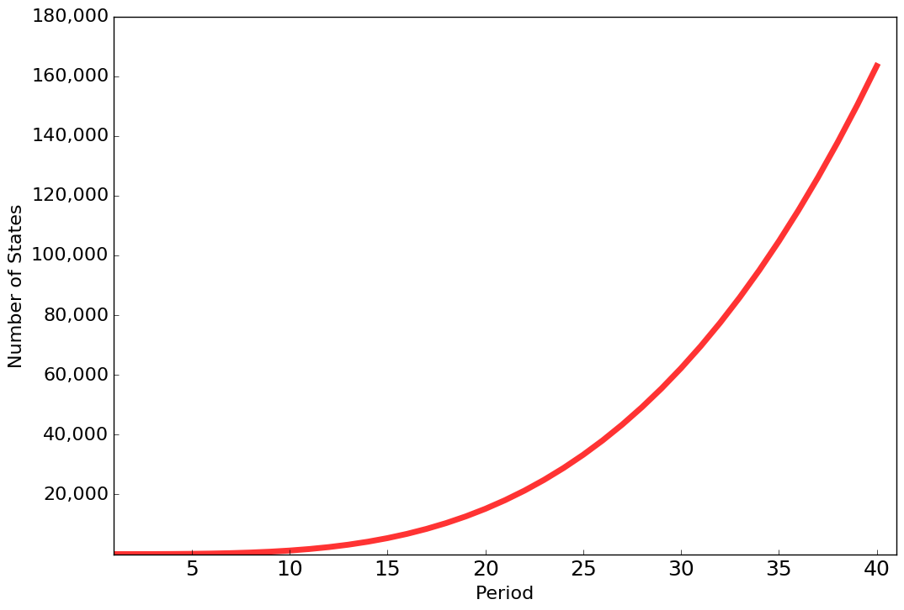
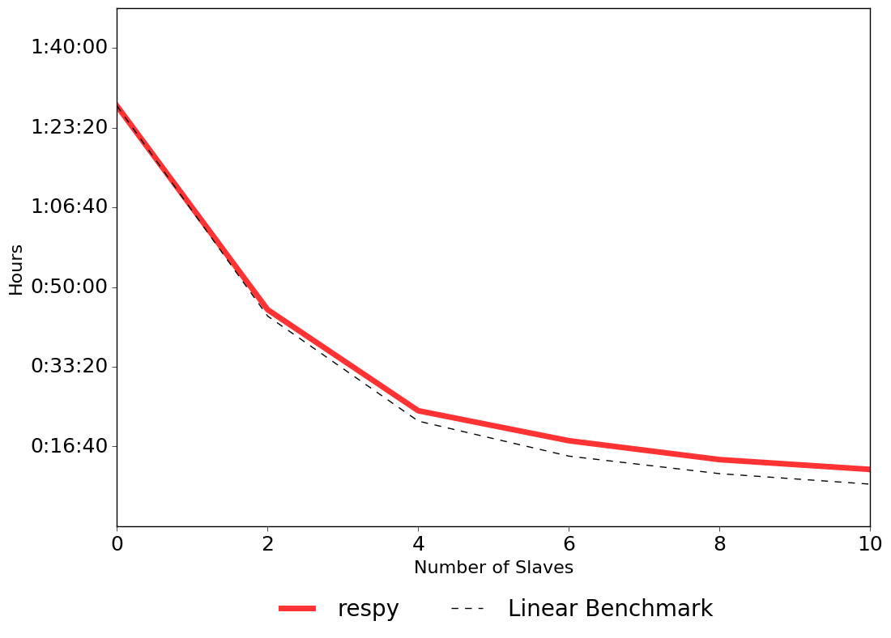

Scalability
===========

The solution and estimation of finite-horizon discrete choice dynamic programming model
appears straightforward. However, it entails a considerable computational burden due to
the well known curse of dimensionality (Bellman and Dreyfus, 1962). The figure below
illustrates how the total number of states increases exponentially with each period.

During an estimation, thousands of different candidate parameterizations of the model
are appraised with respect to the sample likelihood. Each time we need to evaluate the
four-dimensional integral of :math:`E\max` at a total of 163,410 states. Thus, in
addition to Python, we also maintain a scalar and parallel Fortran implementation. We
parallelize the workload using the master-slave paradigm. We assign each slave a subset
of states to evaluate the :math:`E\max` and a subset of agents to simulate their choice
probabilities. Below, we show the total computation time required for 1,000 evaluations
of the criterion function as we increase the number of slave processors to ten. Judging
against the linear benchmark, the code scales well over this range.

Adding even more processors, however, does not lead to any further improvements, it even
increases the computational time. The main reason is the time spend on the
synchronization of :math:`E\max` across all processes each period. Even though each
slave is only working on a subset of states each period, they need to access all
previous :math:`E\max` results during the backward induction procedure.

For more details, see the script `online <https://github.com/OpenSourceEconomics/respy/
blob/janosg/development/documentation/scalability/run_scalability.py>`_ and the `logfile
<https://github.com/OpenSourceEconomics/respy/blob/janosg/doc/results/scalability.respy.
info>`_.
